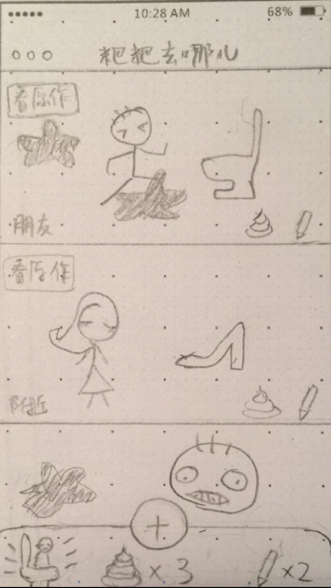
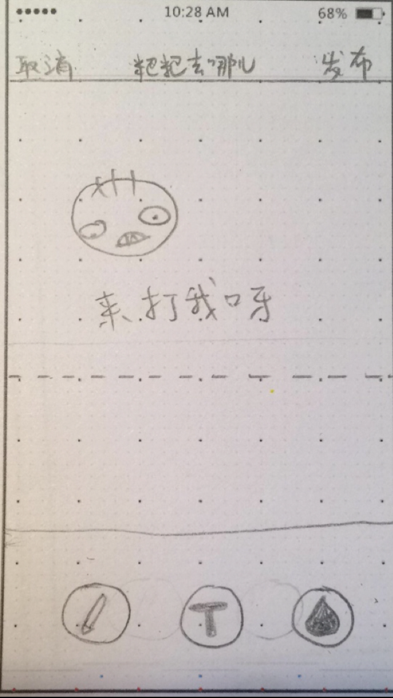
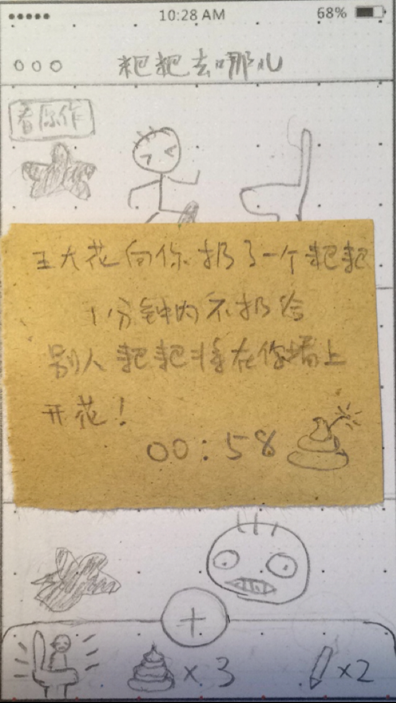

离职前画的小作品，不过前BOSS不喜欢。自娱自乐。

     你还在蹲马桶的时候看报纸嘛？

     快点来玩《粑粑去哪儿》！

     还记得小时候想要向讨厌的人丢粑粑的冲动嘛？

     还记得久违的厕所漫画嘛？

    《粑粑去哪儿》让你重拾童趣！

     还满足你做小时候不敢做的事情，向别人丢粑粑！！

（广告词好顺溜呀。。。）

 #主界面   

主界面显示每个用户的漫画墙作品，点击可看大图。针对每块漫画墙有“丢粑粑”和“乱画”两种操作。

用户掀开马桶盖，蹲下去，打开《粑粑去哪儿》APP，打开时间越长，积累的粑粑就越多。比如每一分钟增加一个可丢的粑粑。

等待粑粑生成的时候，可以画漫画，每画一格漫画，就增加一个“乱画”别人的权限次数。

每个漫画墙被丢了粑粑以后，就呈现被砸了粑粑的效果（即图中黑色不规则阴影）。

被丢的粑粑越多，“阴影”越多，漫画面目全非，就需要点击“看原作”，才能看到干净的原画。

#发布漫画

 
发布漫画时，有“手绘”、“添加文字”、“更换背景色”三种功能。

更换背景色按钮被按一下，切换一种颜色。

可只画一格漫画，也可以画很多格。主界面只呈现第一格漫画。

#丢粑粑规则

丢把把的游戏规则与击鼓传花相似。一分钟内不丢给第三个人，粑粑就会被砸在自己的漫画墙上。配以嗯嗯成功时的音效。

